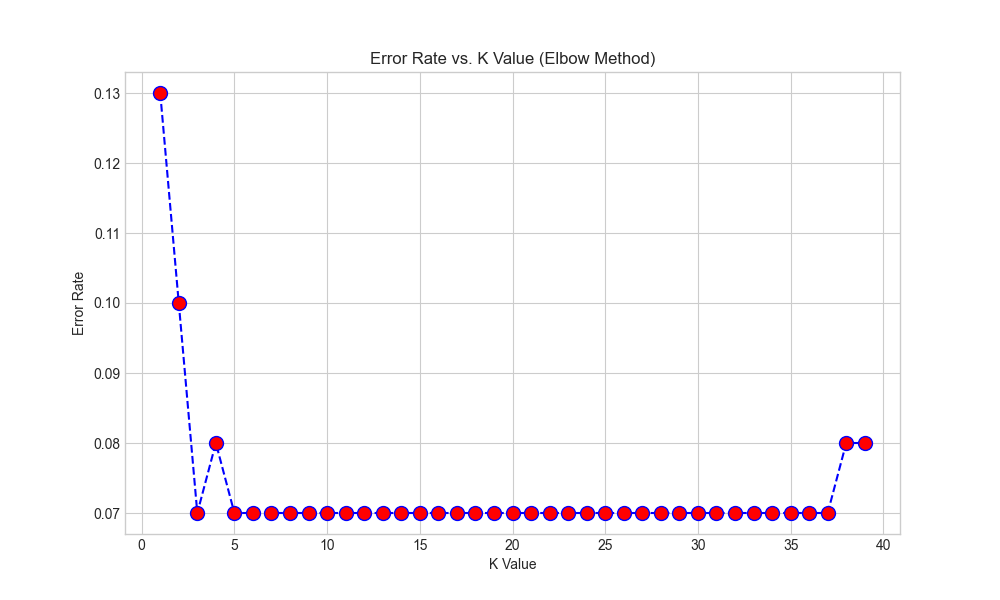
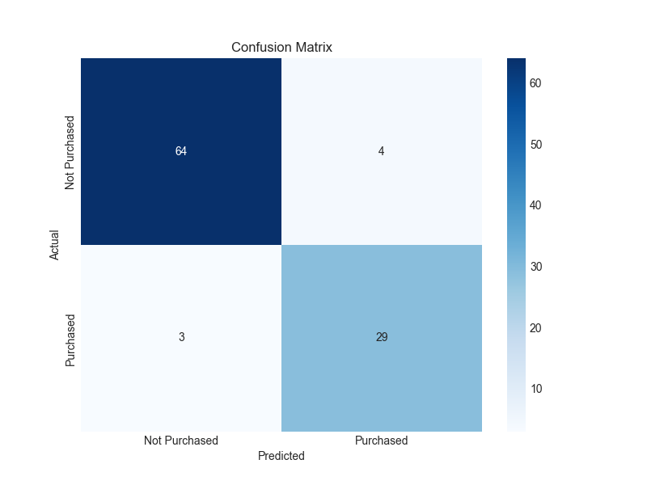
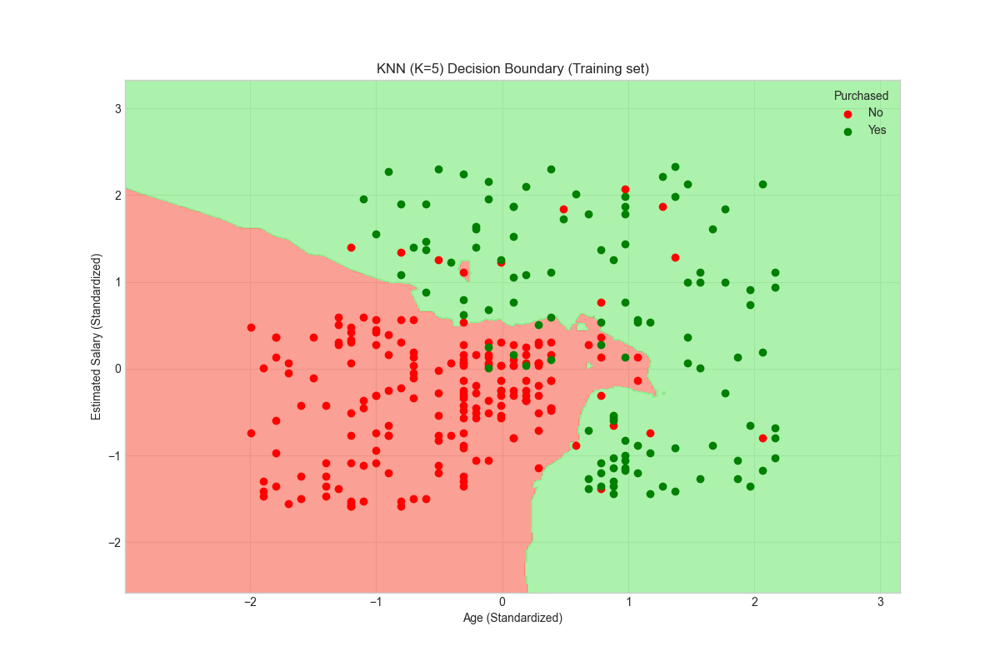

## Methodology

The project workflow is as follows:
1.  **Data Loading & Exploration**: The dataset is loaded, and an initial analysis is performed to understand its structure and statistics.
2.  **Preprocessing**:
    - The data is split into training (75%) and testing (25%) sets.
    - **Feature Scaling** is applied using `StandardScaler` to normalize the `Age` and `EstimatedSalary` features. This is critical for KNN, as it's a distance-based algorithm.
3.  **Finding Optimal K**: The **Elbow Method** is implemented to find the most suitable value for K by plotting the error rate for K values from 1 to 39. The "elbow" point indicates the optimal K.
4.  **Model Training**: A `KNeighborsClassifier` is trained on the scaled training data using the optimal K value (K=5) and Euclidean distance.
5.  **Evaluation**: The model's performance is evaluated on the test set using:
    - **Accuracy Score**: Overall correct predictions.
    - **Confusion Matrix**: To understand true/false positives and negatives.
    - **Classification Report**: Providing precision, recall, and F1-score.
6.  **Visualization**: The decision boundary of the trained classifier is plotted to visually represent how the model separates the two classes.

## Key Results

### Optimal K Value
The Elbow Method plot indicated that **K=5** is an optimal choice, as the error rate stabilizes around this point.



### Model Performance
- **Accuracy**: **93.00%** on the test set.  
- **Confusion Matrix**:  
    
- **Classification Report**: The model shows strong precision and recall for both classes.

### Decision Boundary
The following plot visualizes how the KNN model partitions the feature space to classify users.



## Execution Instructions

1.  **Clone the repository**:
    ```bash
    git clone https://github.com/Kool-K/knn-classifier-social-network-ads.git
    cd root_folder_name
    ```
2.  **Create a virtual environment and install dependencies**:
    ```bash
    python -m venv venv
    source venv/bin/activate  # On Windows, use `venv\Scripts\activate`
    pip install pandas numpy matplotlib seaborn scikit-learn jupyter
    ```
3.  **Launch Jupyter Notebook**:
    ```bash
    jupyter notebook
    ```
4.  Open the `notebooks/knn_classification_analysis.ipynb` file and run the cells.
